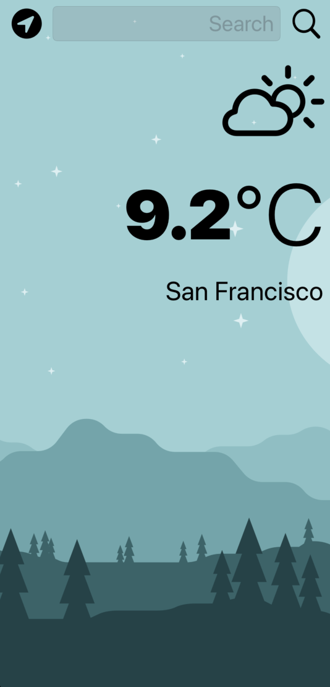
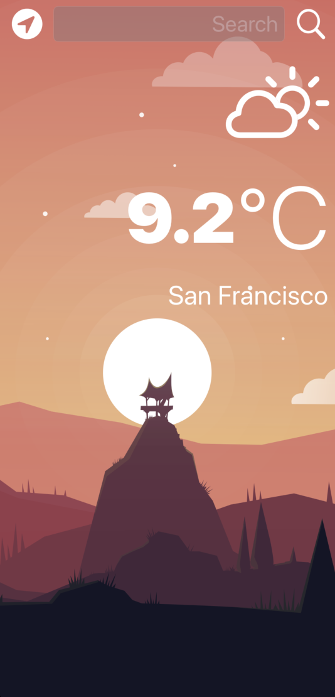
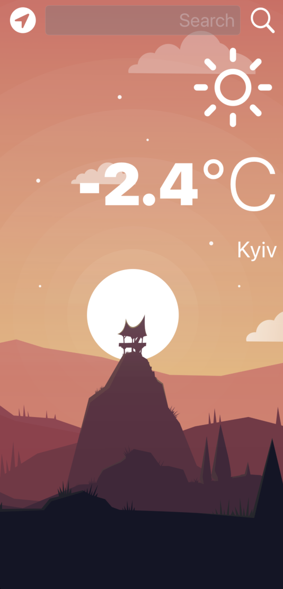

#  Clima

### An iOS/iPadOS weather app with the ability to use geolocation

## Used technologies and tools

- Swift
- UIKit
- MVC design pattern
- URLSession
- JSONDecoder
- [OpenWeather API](https://openweathermap.org/api)

*This project was developed as part of The Complete iOS App Development Bootcamp by London App Brewery*

*Minimum supported OS version is 13.0*

## Illustrations

### Application screen in light theme:

### Application screen in dark theme:

### Check weather in searching city:

